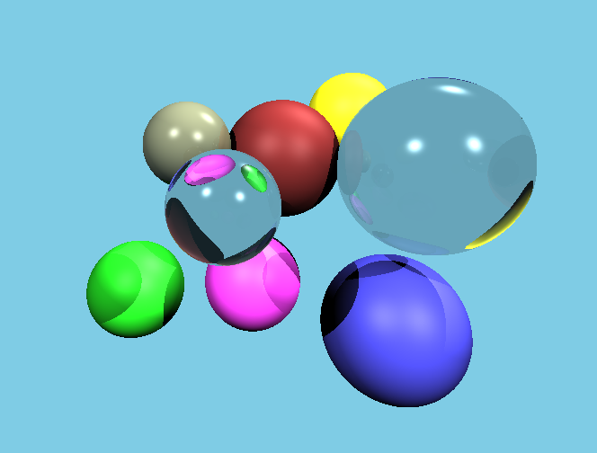

# Rusty Ray Tracing

My take on the [Understandable RayTracing in 256 lines](https://github.com/ssloy/tinyraytracer/wiki/Part-1:-understandable-raytracing) tutorial, but written in Rust.
 
It uses `sdl2` (and `sdl2-gfx`) for rendering, and `glam` for math.

